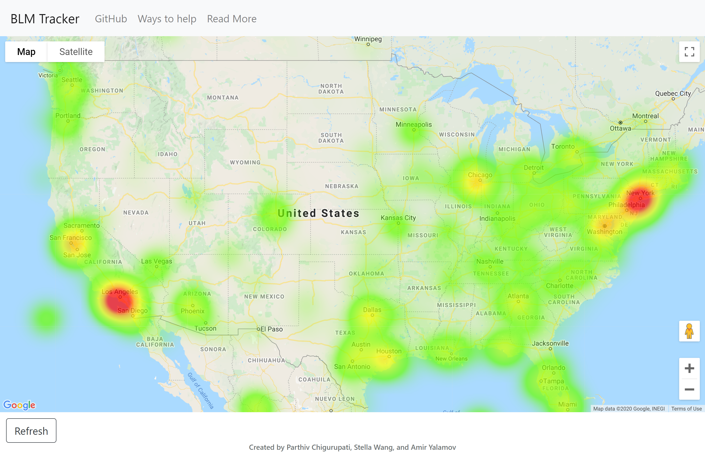
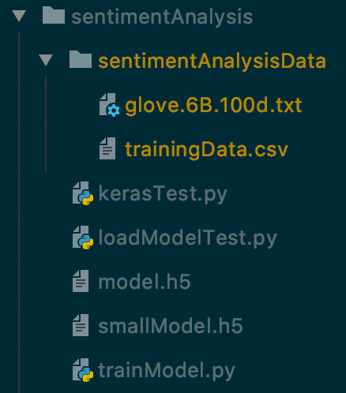

# BLM Tracker
Python project that streams Twitter data through a classifier to determine the amount of social activity surrounding a social movement and visualizing it


## Installation
You can download the code for this project by executing the following:
```
git clone git@github.com:MLH-Fellowship/0.1.1-BLM-Tracker.git
```
Next, you need to acquire [Twitter API](https://developer.twitter.com/en) and [Google Maps API](https://developers.google.com/maps/documentation/javascript/get-api-key) keys, and populate them into `userAPIKeys.py` 

After you have acquired the necessary API keys, download the following [GloVe](http://nlp.stanford.edu/data/glove.6B.zip) dataset (NOTE: this will start an 822MB download)

If you wish to train your own model, you can download a dataset of 1.6 million tweets [here](https://drive.google.com/u/0/uc?export=download&confirm=fK_D&id=0B04GJPshIjmPRnZManQwWEdTZjg) (This will start a 78MB download)

Organize and name your files as per the file structure below




## Inspiration

With all the Black Lives Matter protests going on in the United States and around the world, social media plays a central role in making people's voices on the matter heard. We thought it would be a great step up if we could visualize the world's social media activity regarding the movement and see which cities and countries are the most active.  

## What It Does

BLM Tracker uses relevant tweets from twitter to create a heat map of which cities are the most active about the movement on social media. It does this by parsing tweets from twitter and using a sentiment analysis model to classify tweets relevant to the BLM movement based on keywords and phrases. It then stores those tweets in a MongoDB instance. It then uses a Flask front-end to connect to the MongoDB instance and iterate through the tweets and create a JSON object of a collection of the latitude and longitude for each of those tweets. This gets passed into the Google Maps API, which creates the heat map.

## How We Built It

This project was built in Python, HTML, and JavaScript.

## What We Learned

We learned a lot about Keras and how sentiment analysis worked. We also learned a lot about several other open source projects like BentoML while researching about different tools we could use for our project.

Further, we learned a ton about Flask and how to integrate MongoDB, parse entries for necessary info, format JSON objects, and integrate all that with the Google Maps API. 

## What's next for BLM Tracker

There are definitely a lot of features that can be further implemented to enhance the experience of the heat map. A desirable one would be to have a sidebar showing the most recent tweets, or a sidebar showing trending keywords.

## Technologies Used
### Open Source 

* [Blackbox](https://github.com/StackExchange/blackbox)
    * An open-source tool used for file encryption (specifically the API keys)
* [Flask](https://github.com/pallets/flask)
    * A Python microservice used for building and deploying web applications
* [Keras](https://github.com/keras-team/keras)
    * A neural network API running on top of other neural network frameworks (in this case TensorFlow)
* [langdetect](https://github.com/Mimino666/langdetect)
    * A port to Python of Google's language-detection library
* [MongoDB](https://github.com/mongodb/mongo)
    * Database used to store tweets
* [nltk](https://github.com/nltk/nltk)
    * Natural Language Toolkit used to tokenize tweets for word analysis
* [NumPy](https://github.com/numpy/numpy)
    * Library used for array manipulation and data processing for Keras
* [Pandas](https://github.com/pandas-dev/pandas)
    * Data analysis tool used for data ingest and manipulation
* [TensorFlow](https://github.com/tensorflow/tensorflow)
    * The machine learning framework behind Keras used for sentiment analysis of tweets
* [tqdm](https://github.com/tqdm/tqdm)
    * Progress bar used for visualizing load times and model processing
* [Tweepy](http://docs.tweepy.org/en/latest/)
    * An open-source python library used to access the Twitter API
### Other
* [Google Maps API](https://developers.google.com/maps/documentation)
    * Google Maps API used for address validation and geocode coordinate extraction
* [Twitter API](https://developer.twitter.com/en/docs)
    * Used to stream tweets live into the sentiment analysis model